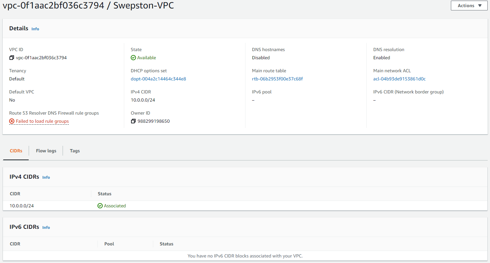
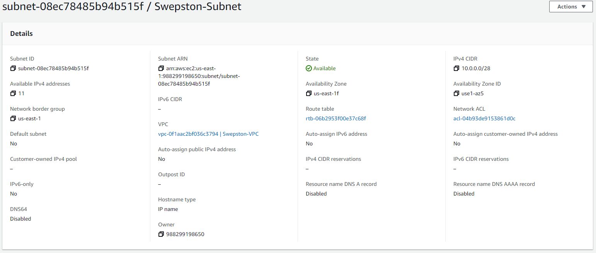
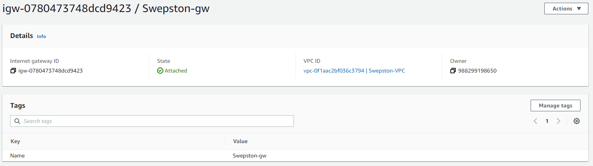
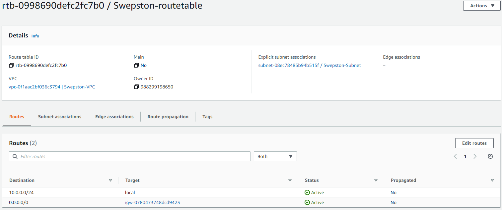
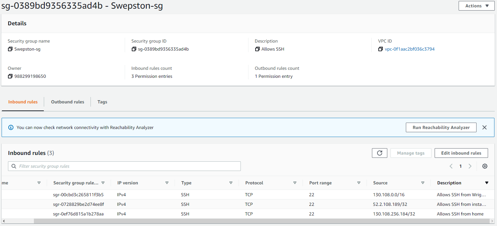
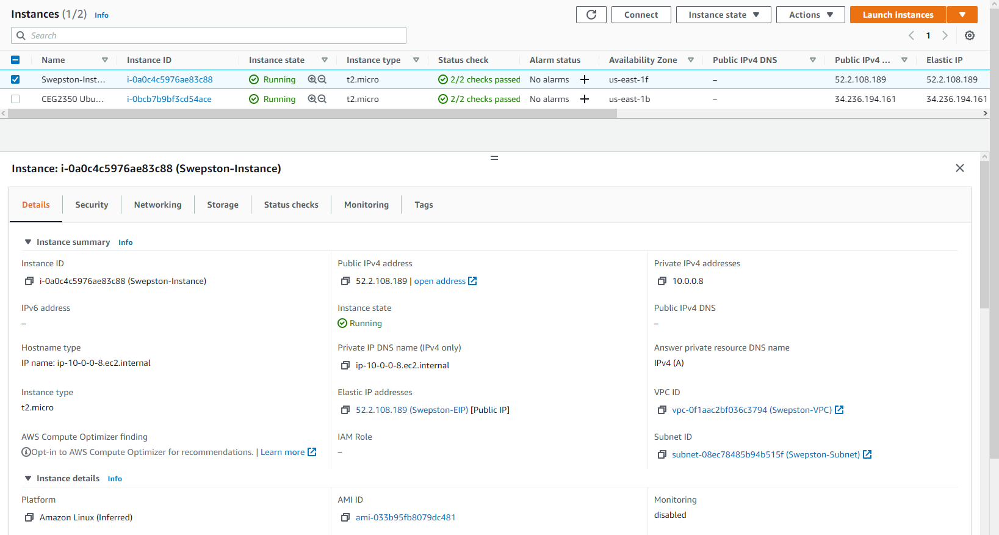
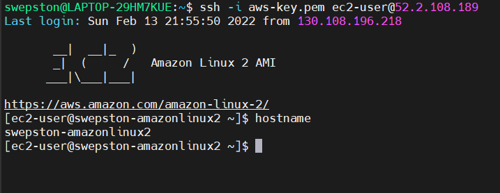

# Project 2

## Part 1
1. VPC - virtual network dedicated to my AWS account
   
2. Subnet - the range of IP addresses in my VPC
   
3. Internet Gateway - enables communication between recourse in my VPC and the internet
   
4. Route Table - set of rules that determine where network traffic is directed
   
5. Security Group - network firewall for my VPC
   

## Part 2
1. Amazon Linux 2 AMI
   t2.micro
2. I clicked the `Network` drop-down and selected my VPC
3. I decided against auto-assigning a Public IPv4 address, so that the address I do end up signing to my instance will not have the chance to be changed
4. By default a root volume is added, so all I did was increase the size to 16 from 8 then click next
5. I pressed `click to add a Name tag` then set the name to "Swepston-Instance"
6. I clicked `Select an existing security group` then clicked "Swepston-sg"
7. I pressed `Allocate Elastic IP address`, then `allocate`. I went to the actions drop-down, selected `Associate Elastic IP address`, chose my instance, selected the private IP address and clicked `Associate`
8. 
10. 
