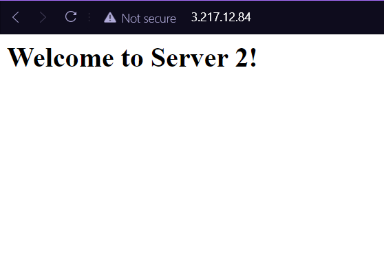

# Project 4

## Part 2
1. At the top of /etc/hosts inserting `10.0.1.15 webserv1` allows `webserv1` to be used instead of `10.0.1.15`
2. `ssh -i aws-key.pem proxy / ssh -i aws-key.pem webserv1 / ssh -i aws-key.pem webserv2`
3. - haproxy.cfg was edited in /etc/haproxy
   - frontend and backend were configured
   - sudo systemctl restart haproxy
   - haproxy.com
4. - `index.html` was modified in /var/www/html
   - No configurations were set
   - They were located at /var/www/html because that is the default for Apache
   - sudo systemctl restart apache2
   - digitalocean.com
5. 
   

